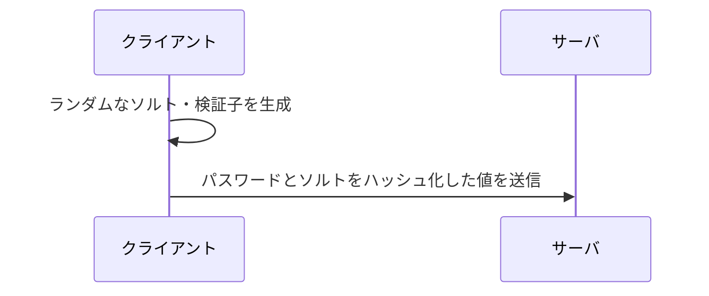
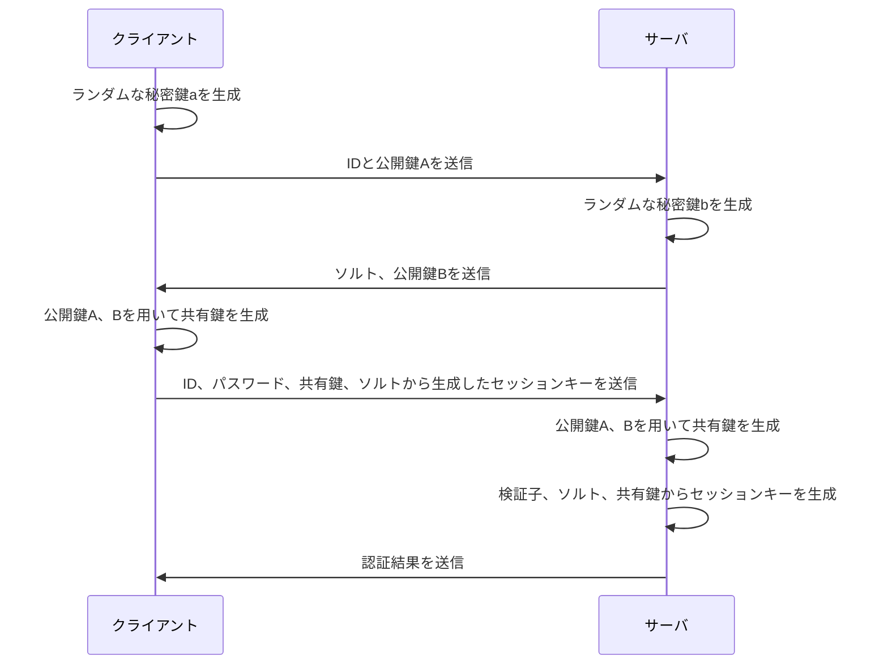

## はじめに

こんにちは、[@caru_ini](https://x.com/caru_ini)です。今回は、インターネットの安全なパスワード認証を支える SRP プロトコルについて紹介していきます。

:::message
本記事は、わかりやすさを重視しています。正確性については保証しませんので、正確な情報が必要な場合は公式ドキュメントなどを参照してください。
:::

## SRP (Secure Remote Password) とは

**Secure Remote Password** (SRP) は、パスワード認証のための認証キー交換プロトコルです。
1997 年にスタンフォード大学で開始されたプロジェクトで、安全、利便性、オープン性、シンプルさを目指して開発されました。
SRP は、**パスワードをサーバに送信することがない**ので、盗聴や中間者攻撃から保護され、安全な認証を提供します。
実際に Amazon Cognito などのサービスで採用されていることもあり、実用性が高いプロトコルです。

## 主な特徴

SRP は、主に以下の特徴を持っています。

- パスワードをサーバに送信しない
- サーバ側にパスワードのハッシュ値を保存しない
- 秘密鍵はすべて１回限りのランダムな値

## おおまかな流れ

はじめから数式を使って説明すると理解が難しいので、まずは簡単な仕組みとおおまかな流れを理解してから、数式を見ていきましょう。

### 登録時

ユーザーはユーザー名とパスワードを入力すると、クライアント側でランダムなソルトやメールアドレス、パスワードから生成される検証子を生成します。
検証子を用いると、サーバ側でパスワードを保存することなく、パスワードの正当性を検証できます。検証子は不可逆であり、検証子から元のパスワードを復元することはできません。

### 認証時

最初に、クライアント側で**ランダムな秘密鍵** `a` とそれから生成される効果鍵 `A` を生成します。
クライアントはユーザー名とともに公開鍵 `A` をサーバに送信します。

サーバ側でも同様に**ランダムな秘密鍵** `b` と検証子`v`から生成される公開鍵 `B` を生成します。

その後、サーバーは検証子とソルトが保管されているデータベースからソルトを取得し、ソルトと公開鍵`B` をクライアントに送信します。

クライアントとサーバーは、**それぞれの公開鍵** `A` と `B` を用いて共有鍵を生成し、それを用いてセッションキーを生成します:

クライアントは、ユーザー名、パスワード、共有鍵、ソルトを用いてセッションキーを生成し、
それを**ハッシュ化したもの**をサーバに送信します。
サーバに送信します。

サーバーは、検証子、ソルト、共有鍵を用いてセッションキーを生成します。

最後に、サーバーでセッションキー(正確にはそのハッシュ)が一致するかを確認し、認証結果をクライアントに送信します。

なぜセッションキーが一致するのかは、この後の数学的な説明で詳しく説明します。

## 数学的な説明

数学的な説明をすると、以下のような数式になります。

### 記号

- $H()$: ハッシュ
- $N$: 非常に大きく安全な素数。javascript の `BigInt` に入り切らないほど大きい
- $g$: modulo $N$ での生成元
- $k$: SRP-6a では、$k = H(N, g)$
- $s$: ソルト
- $I$: ユーザー名
- $p$: パスワード(平文)
- $x$: ハッシュ化されたソルトとパスワード。$x = H(s, p)$
- $a$, $b$: ランダムな秘密鍵
- $A$, $B$: $a$, $b$ から生成される公開鍵。後述
- $u$: ランダムスクランブリングパラメータ。後述
- $S_c$, $S_s$: クライアントとサーバーのセッションキー
- $K$: $S$ をハッシュ化したもの。正しいとき、$K_c = K_s$

:::details 使用する性質 (補足)

- 指数法則: $(a^b)^c = a^{bc}$
- $mod$ の性質: $(a + b) \mod N = (a \mod N + b \mod N) \mod N$\
   例えば、$a = 2$ $b = 3$ $N = 5$ の場合、$(2 + 3) \mod 5 = (2 \mod 5 + 3 \mod 5) \mod 5 = 0$

:::

### 要件

> ユーザーは、$B == 0 (\mod N)$ または $u == 0$ を受信した場合に中止する。
> ホストは、$A == 0 (\mod N)$ を検出した場合に中止する。
> ユーザーは先に$K$を提示しなければなれない。もしサーバーが$K$の不一致を検知した場合、サーバーは自分の持つ$K$を提示せずに中止する。
> <http://srp.stanford.edu/design.html> より引用

### 登録時

- ユーザーは、ユーザー名 $I$ とパスワード $P$ を入力し、クライアント側でランダムなソルト $s$ と検証子 $v$ を生成します。

$$
x = H(s, P) \\
v = g^x\mod N
$$

- サーバーに送信・保存されるのは、`I`, `s`, `v` と任意の他の情報のみです。

### 認証時

- クライアントは、ランダムな秘密鍵 $a$ とそれから生成される公開鍵 $A$ を生成します。

$$
A = g^a\mod N
$$

- サーバーも同様に、ランダムな秘密鍵 $b$ と検証子から生成される公開鍵 $B$ を生成します。

$$
B = kv + g^b\mod N
$$

- クライアントは、ユーザー名 $I$ と公開鍵 $A$ をサーバーに送信します。
- サーバーは、ユーザー名 $I$ からソルト $s$ を取得し、公開鍵 $B$ をクライアントに送信します。
- クライアントとサーバーは、それぞれの公開鍵 $A$, $B$ から共有鍵 $u$ を生成します。

$$
u = H(A, B)
$$

- クライアントは、ユーザー名 $I$, パスワード $P$, 共有鍵 $u$, ソルト $s$ からセッションキー $K$ を生成します。

$$
S_c = (B - kg^x)^{a + ux} \mod N\\
K_c = H(S)
$$

- サーバーは、検証子 $v$, ソルト $s$, 共有鍵 $u$ からセッションキー $S_s$ を生成します。$K$ はそれをハッシュ化したものです。

$$
S_s = (A \cdot v^u)^b \mod N\\
K_s = H(S)
$$

- $K_c = K_s$ であれば、認証は成功です。

### なぜ $S_c$ と $S_s$ が一致するのか

$S_c$ と $S_s$ が一致する証明は、以下のようになります。

$$
S_c = (B - kg^x)^{a + ux} \mod N
$$

$B - kg^x$ について考えると、

$$
B - kg^x = kv + g^b - kg^x \mod N
$$

$v = g^x \mod N$より、

$$
B - kg^x = kg^x - kg^x + g^b \mod N
$$

よって、

$$
S_c = (g^b)^{a + ux} \mod N
$$

同様に、

$$
S_s = (A \cdot v^u)^b \mod N
$$

$A \cdot v^u$ について考えると、\
$A$ と $v$の定義より、

$$
A \cdot v^u = g^a \cdot (g^x)^u \mod N
$$

指数法則より、

$$
A \cdot v^u = g^{a + ux} \mod N
$$

よって、

$$
S_s = (g^{a + ux})^b \mod N
$$

よって、$S_c$ と $S_s$ を比較すると、

$$
S_c = g^{b(a + ux)} \mod N\\
S_s= g^{(a + ux)b} \mod N
$$

$S_c = S_s$ となります。

## まとめ

SRP プロトコルの特徴や仕組み、数学的な説明を紹介しました。
最初はとても複雑な処理かと思って身構えていましたが、実際は高校数学の範囲で理解できる内容で、とても興味深いものでした。
認証の仕組みに興味を持つとてもいい機会になりました。
このような技術が世の中を支えていることを知ると、非常に感慨深いですね。

間違いやご指摘があれば、下記のコメント欄 or [X](https://twitter.com/caru_ini) までお知らせいただけると幸いです。

## 参考文献

http://srp.stanford.edu/

https://akalankapathirage.medium.com/how-to-never-store-or-even-know-your-users-passwords-intro-to-srp-and-aws-cognito-c53de8dedcb2
